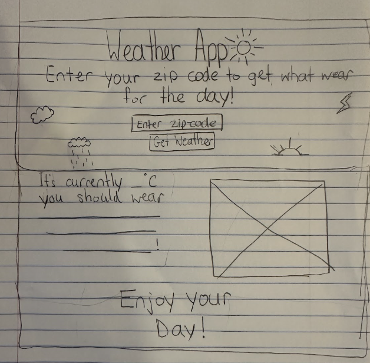

# Entry 5 (Finishing MVP)
##### 4/26/25
## Content
Over the past few weeks, I continued learning how to use the Open-Meteo API to get weather data for my app while also finishing my MVP. To do this, I used both the [Nominatim API](https://nominatim.org/release-docs/3.6/develop/Postcodes/), and [Open-Meteo APi](https://open-meteo.com/en/docs?latitude=40.7143&longitude=-74.006&current=temperature_2m&forecast_days=1) to improve my understanding and build new features.

 ### How I finished my MVP:
In the beginning, I was very confused. I already had some code written, but I didn’t like how it was going, so I deleted everything. I wasn’t sure where to start, and I realized I needed a better plan. I took out a piece of paper and drew a wireframe of my project, which helped me a lot. Even though I didn’t follow the plan exactly, it gave me a clear starting point. Below is a picture of my plan:
   
   
After designing a background in Canva, I started building my app using HTML and JavaScript. In my JavaScript, I created a function called `getWeather()` that first gets the zip code the user enters. When the user submits the zip code, the app shows a "Loading..." message while it works. I then used the Nominatim API to turn the zip code into latitude and longitude coordinates. If the zip code is invalid and no location is found, the app tells the user "Invalid zip code." If the zip code is valid, I used the coordinates to call the Open-Meteo API and get the current weather data. Finally, I pulled the current temperature from the weather data, which I could then display to the user.

```js
 function getWeather() {
        var zip = document.getElementById("zip").value;
        var result = document.getElementById("result");
        result.innerText = "Loading...";

        // Fetch latitude and longitude using the zip code from Nominatim API
        fetch("https://nominatim.openstreetmap.org/search?postalcode=" + zip + "&country=us&format=json")
            .then(function(response) {
                // Convert the response to JSON so JavaScript can use it
                return response.json();
            })
            .then(function(data) {
                // If no location is found, tell the user the zip code is invalid
                if (data.length === 0) {
                    result.innerText = "Invalid zip code.";
                    return; // Stop the function
                }

                // Get latitude and longitude from the first search result
                var lat = data[0].lat;
                var lon = data[0].lon;

                // Use Open-Meteo API to fetch current weather data for the location
                fetch("https://api.open-meteo.com/v1/forecast?latitude=" + lat + "&longitude=" + lon + "&current_weather=true")
                    .then(function(response) {
                        // Convert weather response to JSON
                        return response.json();
                    })
                    .then(function(weatherData) {
                        // Get the current temperature from the data
                        var temp = weatherData.current_weather.temperature;

```
Lastly, I added if statements to my code to give users advice on what to wear based on the temperature. In my original plan, I also wanted to add images of different clothing items to make it more visual, but I did not have a lot time and wasn’t able to include them.

 ## Engineering Design Process 
I'm currently in step 7 of the engineering design process, where I'm working on improving my weather app. I'm focusing on adding a feature that lets users see the temperature in Fahrenheit, not just Celsius, and including images to make the clothing suggestions more visual. Right now, I'm making these improvements to make the user experience better. Once I finish, my next step will be to communicate my results with others.
 ## Skills   
 Some skills that I’ve learned from working on this blog are **problem decomposition**, and **time management**

 ### Problem decomposition
I’ve learned how important it is to break problems down and take things step-by-step. For example, when I felt stuck at the beginning of my project, I stopped and drew a plan on paper to organize my ideas. Breaking the project into smaller parts made it much easier to get started and stay focused. Problem decomposition has helped me sloved challenges without feeling overwhelmed.

 ### Time management
I’ve also learned the importance of time management throughout this project. During spring break, I had to organize my time carefully because I had a lot of homework since the AP exams were approaching, and I needed to study for the SAT — all while finishing my MVP. Balancing everything taught me how to set priorities and stay on track even when I was busy.

 ## Summary
 Overall, I’m proud of the progress I’ve made and excited to keep improving my project. My next steps are to add the option to see temperatures in Fahrenheit and include images for the clothing suggestions to make the app even better.

[Previous](entry04.md) | [Next](entry06.md)

[Home](../README.md)
